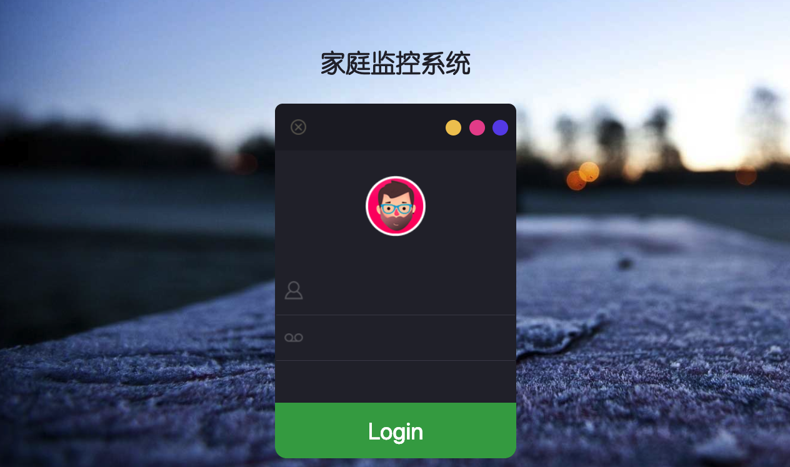

> 在[Kr1s77/flask-video-streaming-recorder](https://github.com/Kr1s77/flask-video-streaming-recorder)的基础上修改

- 调整部分 css 样式
- 修改依赖包版本
- 对移动端适配

# Installing
### 🐍First you should install ``Python3.x`` on your Raspberry Pi

>   $ sudo  apt-get  update
>   $ sudo  apt-get  upgrade
    	
- Install python``dependent environment``

```bash
sudo apt-get install build-essential libsqlite3-dev sqlite3 bzip2 libbz2-dev
```

 
### Next install the module

- Install flask

```bash
$ pip3 install flask
```
    	
- Install opencv

```bash
pip3 install opencv_python==3.4.2.16
```
  
# Running the tests

- Download all files to run
- run main.py

> 	$ python3 main.py -p 0.0.0.0
> 当然你也可以使用`Gunicorn`来当做你的多线程服务器
    	

 - Increased login, a simple login interface, does not need a database
 
 - Test account
 ```
     Username:  admin
     Password:  admin
 ```

 - The structure of this project

 
 
 - A beautiful login interface
 
 